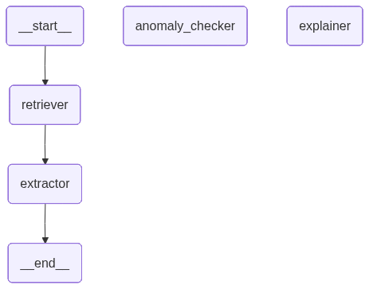

# FinDocAgent

A multimodal agentic system for financial document understanding: extracting structured
data from bank statements, flagging numerical/date anomalies, and answering questions
over long financial documents (annual reports, SEC 10-K filings) via retrieval-augmented
generation. Built as an MSc dissertation project.

## Architecture

FinDocAgent is a [LangGraph](https://github.com/langchain-ai/langgraph) state machine
with four nodes, backed by Qwen2-VL-max (via Alibaba Cloud's DashScope API) as the
vision-language model:



| Node | Role |
|---|---|
| **Retriever** | For document-QA: indexes the PDF into ChromaDB and retrieves relevant pages via hybrid dense + BM25 search. For bank statements: passes the document straight through. |
| **Extractor** | Answers the question from retrieved page images (QA mode), or pulls structured fields (vendor, totals, line items) from the raw document via Qwen2-VL (bank-statement mode). |
| **Anomaly Checker** | Rule-based checks: does the stated total reconcile with opening balance + line items, and are line-item dates chronological. |
| **Explainer** | Formats the final human-readable risk report (bank-statement mode only). |

The graph runs in one of two modes depending on whether a `question` is set in the
agent state:

- **Document QA / RAG mode** — answers a specific question about a document, with up to
  3 retrieval retries if the model returns a "not found"-style non-answer.
- **Bank-statement mode** — extracts structured fields and runs anomaly detection,
  producing a risk report.

Supporting modules:

- `document_parser/` — PDF text/table extraction (pdfplumber) and page rasterization
  (pdf2image).
- `vector_store/` — ChromaDB-backed hybrid retrieval (dense embeddings + BM25 keyword
  search, fused via reciprocal rank fusion).
- `models/` — Qwen2-VL client (`qwen.py`) and local-model attention-map generation
  (`attention_map.py`) for explainability.

## Repo structure

```
agent/                 LangGraph pipeline: graph.py, state.py, nodes/
document_parser/       PDF text/table extraction and page rasterization
vector_store/          ChromaDB hybrid retrieval
models/                Qwen2-VL client, local attention-map generation
evaluation/            All evaluation scripts + results — see evaluation/README.md
data/samples/          Input PDFs (bank statements, annual reports, synthetic test docs)
paper_figures/         Figures used in the dissertation
main.py                Runs the agent end-to-end on a sample bank statement
```

`data/chroma_db/` and `data/page_images/` are generated at runtime (indexed vectors and
rasterized PDF pages) and aren't tracked in git — see Setup below to regenerate them.

## Setup

Requires Python 3.12 and [poppler](https://poppler.freedesktop.org/) (a system dependency
of `pdf2image`, used to rasterize PDF pages — install via your OS package manager, e.g.
`apt install poppler-utils` or `conda install poppler`).

```bash
python -m venv venv
source venv/bin/activate
pip install -r requirements.txt
```

Copy `.env.example` to `~/.env` (or `.env` in the repo root) and fill in the API keys you
need — see the comments in that file for which key backs which script. At minimum,
`DASHSCOPE_API_KEY` is required for the core agent (`main.py`) and most evaluations.

If `poppler` isn't on your `PATH`, set `POPPLER_PATH` in your `.env` to its `bin`
directory.

## Usage

Run the agent end-to-end on the sample bank statement in `data/samples/`:

```bash
python main.py
```

This indexes/extracts the document, runs anomaly detection, and prints a risk report.
Edit `main.py`'s `initial_state` to point at a different document, or add a `"question"`
key to run in document-QA mode instead.

## Evaluation

All benchmark evaluations (DocVQA, FUNSD, SEC 10-K, bank-statement anomaly detection,
multi-model baseline comparisons, explainability/SHAP analysis) live in `evaluation/` —
see [evaluation/README.md](evaluation/README.md) for what each script measures and how to
run it.

### Headline results

| Benchmark | Metric | Result |
|---|---|---|
| DocVQA (50 samples) | ANLS | Qwen2-VL-max 0.952 (single-pass) / 0.960 (full agent) — vs. published LayoutLMv3-LARGE 0.834, vs. naive regex baseline 0.033 |
| FUNSD (50 samples) | ANLS | Qwen2-VL-max 0.792 vs. naive regex baseline 0.194 |
| SEC 10-K, oracle page given (50 Qs) | ANLS | 0.870 |
| SEC 10-K, agent must retrieve the page (39 Qs) | ANLS | 0.658 |
| Bank-statement anomaly detection (10 documents) | F1 | 0.889 (any-anomaly), 1.0 (date ordering), 0.75 (math discrepancy) |

Full per-model breakdowns (GPT-4o, Gemini, Kimi, Gemma, InternVL, SmolVLM comparisons)
are in `evaluation/results/`.