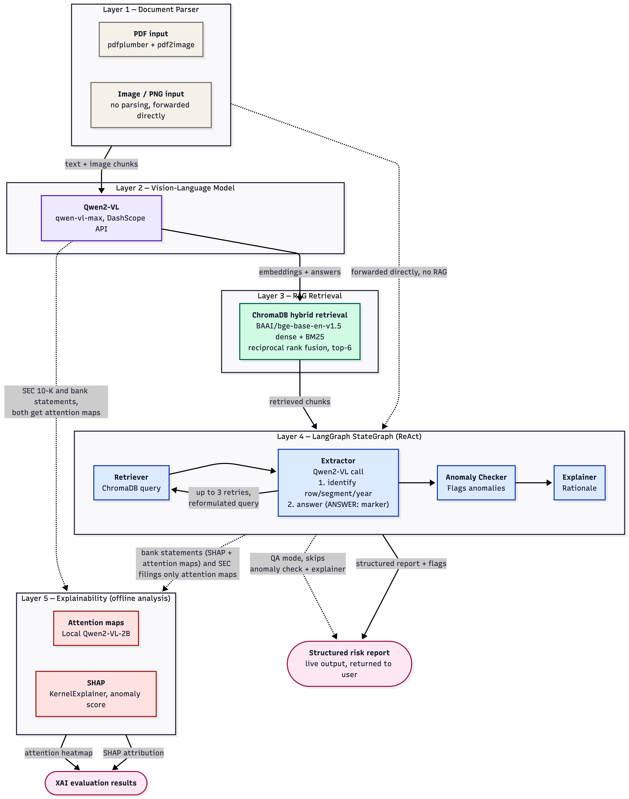

# FinDocAgent

A multimodal agentic system for financial document understanding: extracting structured
data from bank statements, flagging numerical/date anomalies, and answering questions
over long financial documents (annual reports, SEC 10-K filings) via retrieval-augmented
generation.

## Architecture

FinDocAgent is a [LangGraph](https://github.com/langchain-ai/langgraph) state machine
with four nodes, backed by Qwen2-VL-max (via Alibaba Cloud's DashScope API) as the
vision-language model:



| Node | Role |
|---|---|
| **Retriever** | For document-QA: indexes the PDF into ChromaDB and retrieves relevant pages via hybrid dense + BM25 search. For bank statements: passes the document straight through. |
| **Extractor** | Answers the question from retrieved page images (QA mode), or pulls structured fields (vendor, totals, line items) from the raw document via Qwen2-VL (bank-statement mode). |
| **Anomaly Checker** | Rule-based checks: does the stated total reconcile with opening balance + line items, and are line-item dates chronological. |
| **Explainer** | Formats the final human-readable risk report (bank-statement mode only). |

The graph runs in one of two modes depending on whether a `question` is set in the
agent state:

- **Document QA / RAG mode** — answers a specific question about a document, with up to
  3 retrieval retries if the model returns a "not found"-style non-answer.
- **Bank-statement mode** — extracts structured fields and runs anomaly detection,
  producing a risk report.

Supporting modules:

- `document_parser/` — PDF text/table extraction (pdfplumber) and page rasterization
  (pdf2image).
- `vector_store/` — ChromaDB-backed hybrid retrieval (dense embeddings + BM25 keyword
  search, fused via reciprocal rank fusion).
- `models/` — Qwen2-VL client (`qwen.py`) and local-model attention-map generation
  (`attention_map.py`) for explainability.

## Repo structure

```
agent/                 LangGraph pipeline: graph.py, state.py, nodes/
document_parser/       PDF text/table extraction and page rasterization
vector_store/          ChromaDB hybrid retrieval
models/                Qwen2-VL client, local attention-map generation — see models/README.md
evaluation/            All evaluation scripts + results — see evaluation/README.md
data/samples/          Input PDFs (bank statements, annual reports, synthetic test docs) — see data/README.md
paper_figures/         Figures used in the dissertation
main.py                Runs the agent end-to-end on a sample bank statement
```

`data/chroma_db/` and `data/page_images/` are generated at runtime and aren't tracked in git, see Setup below to regenerate them.

## Setup

Requires Python 3.12 and [poppler](https://poppler.freedesktop.org/) (a system dependency
of `pdf2image`, used to rasterize PDF pages — install via your OS package manager, e.g.
`apt install poppler-utils` or `conda install poppler`).

```bash
python -m venv venv
source venv/bin/activate
pip install -r requirements.txt
```

Copy `.env.example` to `~/.env` (or `.env` in the repo root) and fill in the API keys you
need, see the comments in that file for which key backs which script. At minimum,
`DASHSCOPE_API_KEY` is required for the core agent (`main.py`) and most evaluations.

If `poppler` isn't on your `PATH`, set `POPPLER_PATH` in your `.env` to its `bin`
directory.

## Usage

Run the agent end-to-end on the sample bank statement in `data/samples/`:

```bash
python main.py
```

This indexes/extracts the document, runs anomaly detection, and prints a risk report.
Edit `main.py`'s `initial_state` to point at a different document, or add a `"question"`
key to run in document-QA mode instead.

## Evaluation

All benchmark evaluations (DocVQA, FUNSD, SEC 10-K, bank-statement anomaly detection,
multi-model baseline comparisons, explainability/SHAP analysis) live in `evaluation/` —
see [evaluation/README.md](evaluation/README.md) for what each script measures and how to
run it.

### Headline results

| Benchmark | Metric | Result |
|---|---|---|
| DocVQA (50 samples) | ANLS | Qwen2-VL-max 0.952 (single-pass) / 0.960 (full agent) — vs. published LayoutLMv3-LARGE 0.834, vs. naive regex baseline 0.033 |
| FUNSD (50 samples) | ANLS | Qwen2-VL-max 0.792 vs. naive regex baseline 0.194 |
| SEC 10-K, oracle page given (50 Qs) | ANLS | 0.870 |
| SEC 10-K, agent must retrieve the page (39 Qs) | ANLS | 0.658 |
| Bank-statement anomaly detection (10 documents) | F1 | 0.889 (any-anomaly), 1.0 (date ordering), 0.75 (math discrepancy) |

Full per-model breakdowns (GPT-4o, Gemini, Kimi, Gemma, SmolVLM comparisons)
are in `evaluation/results/`.

### Model versions used

| Model | Identifier | Notes |
|---|---|---|
| Qwen2-VL-max | `qwen-vl-max` | Hosted via DashScope; rolling alias, not a dated snapshot — DashScope updates which underlying checkpoint this points to over time. |
| Qwen2-VL-2B-Instruct | `Qwen/Qwen2-VL-2B-Instruct` | Loaded locally for RQ3 attention-map generation only (see `models/README.md`). |
| GPT-4o | `gpt-4o` | OpenAI's rolling default alias, not a dated snapshot (e.g. not pinned to `gpt-4o-2024-08-06`). |
| Gemini | `gemini-3.5-flash` | Via Google's OpenAI-compatible endpoint. |
| Kimi | `kimi-k3` | Moonshot AI. |
| Gemma | `google/gemma-3-4b-it` | Loaded locally via Hugging Face `transformers`. |
| SmolVLM2 | `HuggingFaceTB/SmolVLM2-2.2B-Instruct` | Loaded locally via Hugging Face `transformers`. |

Where a provider only exposes a rolling alias rather than a dated snapshot (Qwen2-VL-max,
GPT-4o), results reflect whichever underlying model version that alias pointed to at the
time each evaluation was run, not a version pinned for reproducibility.

## Datasets

| Dataset | Source | Used for |
|---|---|---|
| DocVQA | [`nielsr/docvqa_1200_examples`](https://huggingface.co/datasets/nielsr/docvqa_1200_examples) on Hugging Face, derived from Mathew, Karatzas and Jawahar (2021) | `evaluation/docvqa_*.py` |
| FUNSD | [`nielsr/funsd`](https://huggingface.co/datasets/nielsr/funsd) on Hugging Face, from Jaume, Ekenel and Thiran (2019) | `evaluation/funsd_*.py` |
| SEC 10-K filings | Goldman Sachs 2023 Annual Report and JPMorgan Chase 2023 Annual Report (public filings), with 39 hand-curated question/answer/oracle-page triples in `data/sec10k_qa.json` | `evaluation/sec10k_*.py` |
| Bank statements | Mix of hand-crafted, synthetically generated, and one stock example — see `data/README.md` for exactly what each file is and its known ground truth | `evaluation/baseline.py`, `evaluation/bank_statement_agent_eval.py`, `main.py` |

## References

European Parliament and Council (2024) *Regulation (EU) 2024/1689 of the European
Parliament and of the Council of 13 June 2024 laying down harmonised rules on
artificial intelligence (Artificial Intelligence Act)*. Official Journal of the
European Union.

Financial Conduct Authority, Prudential Regulation Authority and Bank of England
(2022) *DP5/22: Artificial Intelligence and Machine Learning*. Discussion Paper.
London: Bank of England.

Huang, Y., Lv, T., Cui, L., Lu, Y. and Wei, F. (2022) 'LayoutLMv3: Pre-training for
Document AI with Unified Text and Image Masking', *Proceedings of the 30th ACM
International Conference on Multimedia*, Lisbon, 10-14 October, pp. 4083-4091.

Jaume, G., Ekenel, H.K. and Thiran, J.-P. (2019) 'FUNSD: A Dataset for Form
Understanding in Noisy Scanned Documents', *ICDAR-OST Workshop*.

Lundberg, S.M. and Lee, S.-I. (2017) 'A Unified Approach to Interpreting Model
Predictions', *Advances in Neural Information Processing Systems (NeurIPS)*,
Long Beach, 4-9 December, pp. 4766-4777.

Mathew, M., Karatzas, D. and Jawahar, C.V. (2021) 'DocVQA: A Dataset for VQA on
Document Images', *Proceedings of the IEEE/CVF Winter Conference on Applications
of Computer Vision (WACV)*, pp. 2200-2209.

Wang, P., Bai, S., Tan, S., Wang, S., Fan, Z., Bai, J., Chen, K., Liu, X., Wang, J.,
Ge, W., Fan, Y., Dang, K., Du, M., Ren, X., Men, R., Liu, D., Zhou, C., Zhou, J.
and Lin, J. (2024) 'Qwen2-VL: Enhancing Vision-Language Model's Perception of the
World at Any Resolution', *arXiv preprint arXiv:2409.12191*.

Yao, S., Zhao, J., Yu, D., Du, N., Shafran, I., Narasimhan, K. and Cao, Y. (2023)
'ReAct: Synergizing Reasoning and Acting in Language Models', *International
Conference on Learning Representations (ICLR)*.

Software: LangChain AI (2024) *LangGraph* [software]. Available at:
https://github.com/langchain-ai/langgraph